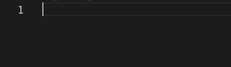
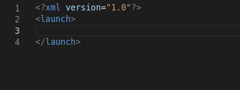
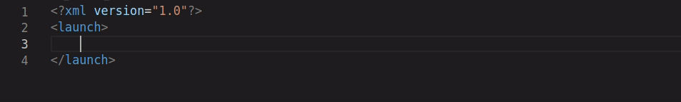
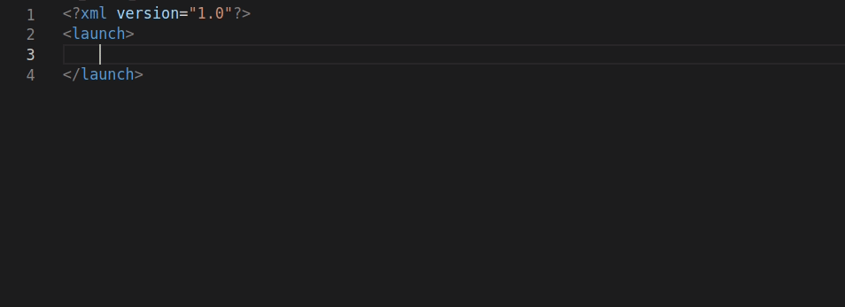
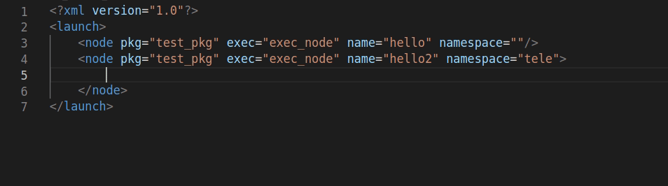

# ROS2-Snippets
Visual Code extension with a collection of ROS2 (Robot Operating System 2) snippets.

## launch file [xml]

prefix: **launch-scope**

prefix: **arg-default**

prefix: **include**

prefix: **node**, **node-scope**, **param**

prefix: **remap**

